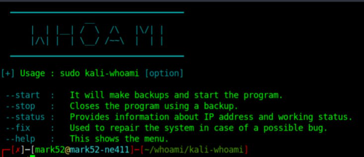
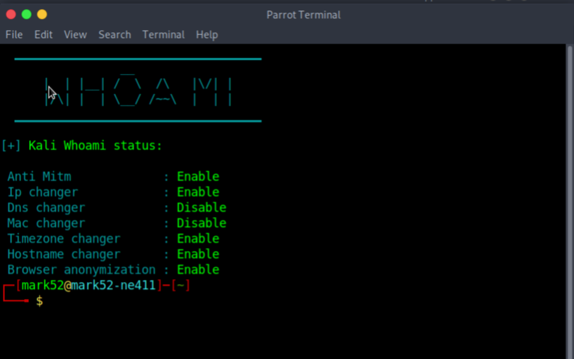
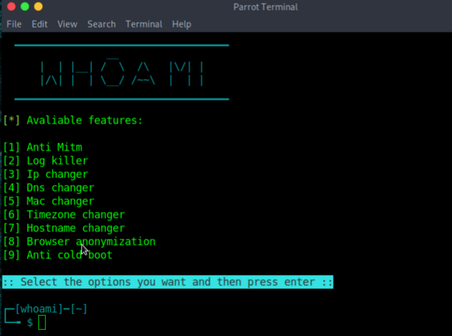
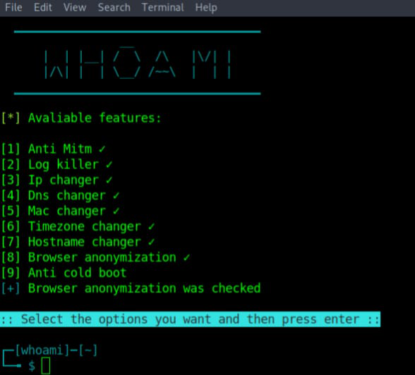
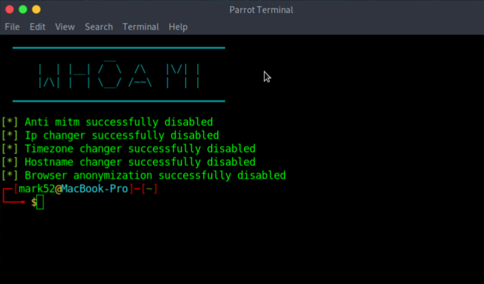
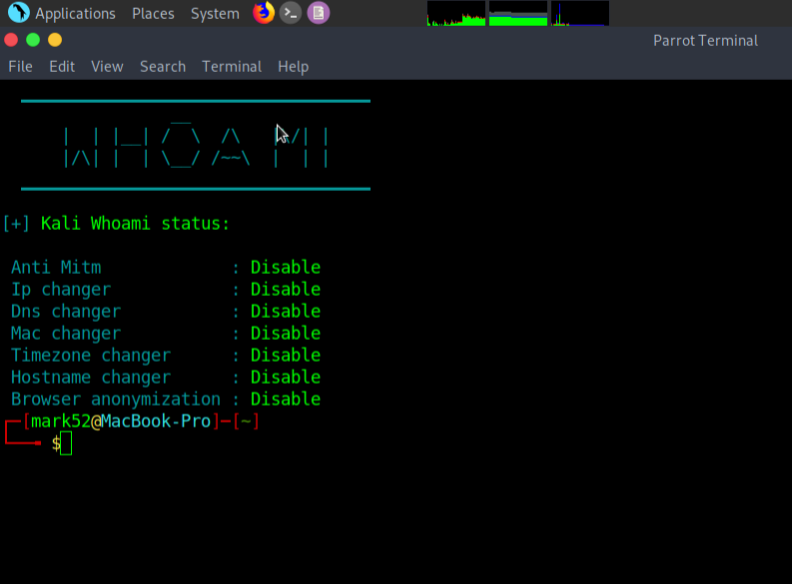

# The Art of Establishing and Maintaining Anonymity
- There exists different ways to maintain anonymity, below we detail different ways of maintaing anonymity using different tools:

## 1. WHOAMI
- The tool has the following features:
    * Anti Man In The Middle
    * Log killer
    * IP changer
    * Domain Name Server changer
    * Mac Spoofer
    * Anti cold boot
    * Changes the timezone
    * Changes the HostName
    * Browser anonymization 
- Before installation check that the following packages are installed: tar, git, tor, curl,python3,python3-scapy.
- To install run the following command:
* `sudo apt update && sudo apt install tar tor curl python3 python3-scapy network-manager`

- Clone the WHOAMI from git and change to kali-whoami directory and follow the steps below to install:

1. git clone https://github.com/omer-dogan/kali-whoami

2. change directory to `kali-whoami` and run the following command: `sudo make install`

3. check if the installation was successful by running the following command: `sudo kali-whoami --help`

- You will see the following image:

4. To check WHOAMI status, run: `sudo kali-whoami --status`

5. Start the tool: `sudo kali-whoami --start`

- should see something like this:

6. Choose options you want to enable and press enter, to disable, press the number again. 
- Should see something similar to this:

5. Stop the tool, run the following command: `sudo kali-whoami --stop`

6. Check the status again run `sudo kali-whoami --status`

